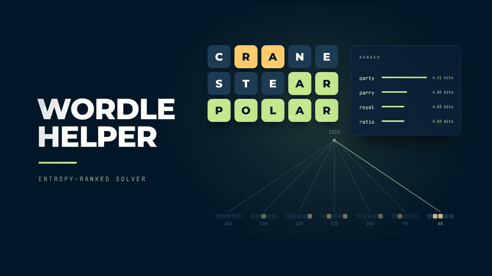

<p align="center">
  
</p>

<h1 align="center">Wordle Helper</h1>

<p align="center">
  <strong>A constraint-based solver that narrows down Wordle answers in real time as you enter guesses and color feedback.</strong>
</p>

<p align="center">
  <a href="https://dangervalentine.github.io/WordleCheater/">Live Demo</a>
</p>

<p align="center">
  <a href="https://dangervalentine.github.io/WordleCheater/">
    
  </a>
</p>

<p align="center">
  
  
  
  
  
</p>

---

Type a five-letter word, then click each tile to cycle through gray, yellow, and green to match your Wordle feedback. The solver immediately filters a built-in dictionary down to only the words that satisfy every constraint, updating live as you add more guesses.

## Features

**Multi-row guesses** &mdash; Add up to six guess rows, just like the real game. Each row locks into color-picking mode once all five letters are entered.

**Tile color cycling** &mdash; Click a filled tile to cycle through gray (absent), yellow (wrong position), and green (correct position). Colors are applied instantly and constraints recalculate on every change.

**Live constraint summary** &mdash; A panel below the grid shows confirmed (green) positions, present-but-misplaced (yellow) letters, and excluded (gray) letters at a glance.

**Filtered results** &mdash; The right panel displays all remaining valid words as chips, with a count header. When narrowed to a single word, it highlights with a glow. Large result sets are paginated with a "show more" toggle.

**Reset** &mdash; One click clears all rows and starts fresh.

## How It Works

```
Guess rows (letters + colors per tile)
        |
        v
  deriveConstraints()
  ├── green[i]  = confirmed letter at position i
  ├── yellow    = letters present but not at marked positions
  ├── gray      = letters excluded entirely
  |               (unless also green elsewhere)
        |
        v
  findResults(constraints)
  ├── Filter dictionary against all green positions
  ├── Exclude gray letters (respecting green overrides)
  └── Require yellow letters exist, but not at excluded positions
        |
        v
  Matching words displayed as chips
```

## Quick Start

```bash
npm install
npm run dev        # dev server at http://localhost:5173/WordleCheater/
npm run build      # type-check + production bundle in ./dist
npm test           # run unit tests
```

Vite's `base` is set to `/WordleCheater/` in [`vite.config.ts`](./vite.config.ts) so assets resolve correctly on GitHub Pages.

## Tech Stack

- **React 19** &mdash; UI with hooks and memoized constraint derivation
- **Vite 6** &mdash; dev server, build, GitHub Pages base path
- **TypeScript 6** &mdash; strict types for tile state, constraints, and row modes
- **Vitest 4** &mdash; unit tests for constraint derivation and dictionary filtering

## Project Structure

```
src/
├── main.tsx                    React 19 createRoot entry
├── App.tsx                     Main app — guess grid, constraints, results layout
├── index.css                   Global styles + design tokens
├── App.css                     Component styles (token-driven)
├── theme.ts                    Night Owl color constants
├── types.ts                    TileColor, RowState, Constraints types
├── constraints.ts              Derive green/yellow/gray from row state
├── helper.ts                   Filter dictionary against constraints
├── dictionary.json             Built-in word list
│
├── components/
│   ├── GuessGrid.tsx           Grid container + row management
│   ├── GuessRow.tsx            Single row — input mode and color mode
│   ├── ConstraintSummary.tsx   Visual constraint breakdown panel
│   ├── Results.tsx             Filtered word chips with pagination
│   └── GithubAttribution.tsx   Bottom-right author + source link
│
└── __tests__/
    ├── constraints.test.ts     Constraint derivation tests
    └── helper.test.ts          Dictionary filtering tests
```

## Deployment

CI is wired up via GitHub Actions:

- [`.github/workflows/deploy.yml`](./.github/workflows/deploy.yml) &mdash; builds and publishes to GitHub Pages on every push to `wordle-fork`.

The deploy workflow uses the modern `actions/deploy-pages` flow. One-time setup on the repo:

1. **Settings &rarr; Pages &rarr; Build and deployment &rarr; Source:** select **GitHub Actions**.
2. Push to `wordle-fork` (or run the workflow manually from the Actions tab).

## License

MIT
